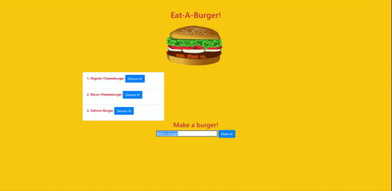

# Eat-A-Burger!


Fun little project that allows you to add a burger you would like to eat to the list and then devour it! (with your mouse). Disclosure: This project may make you hungry.



## Table of Contents
-[Installation](#installation)

-[Usage](#usage)

-[Credits](#credits)

-[Test](#test)

## Installation:

**How to install the project:** Clone the repository from Github and make sure you have node installed, run:

```
npm i
```

To install all dependencies and then run

```
node server.js
```

## Usage:

N/A

## Credits:

**Credits to contributors:** N/A

